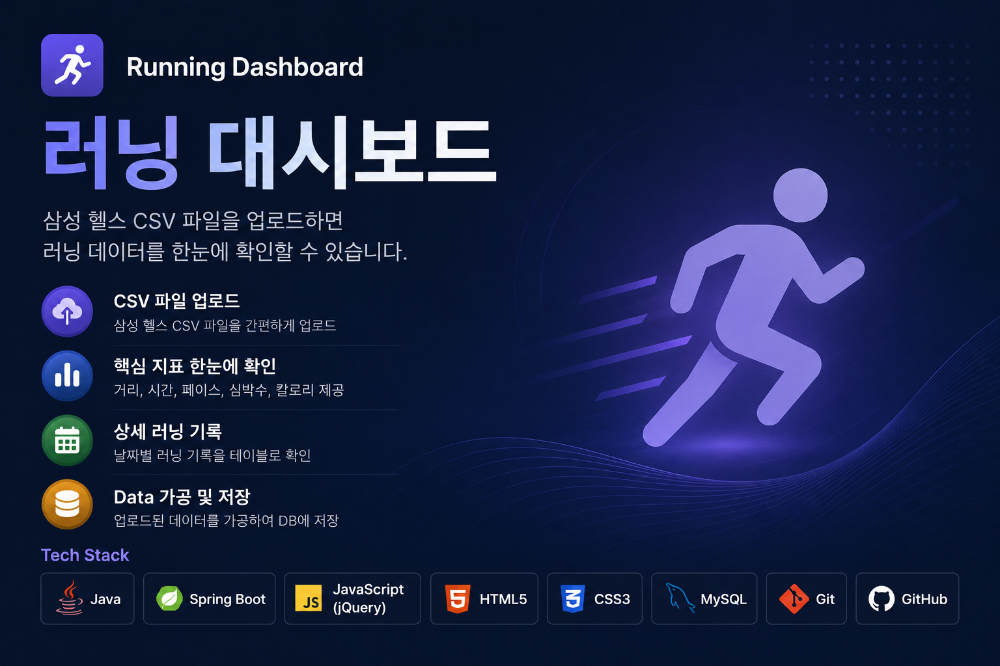
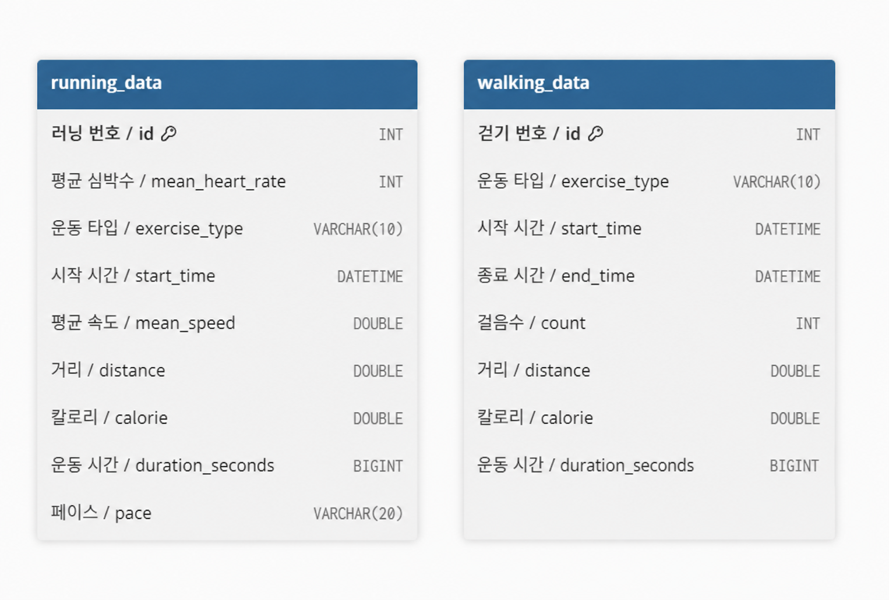
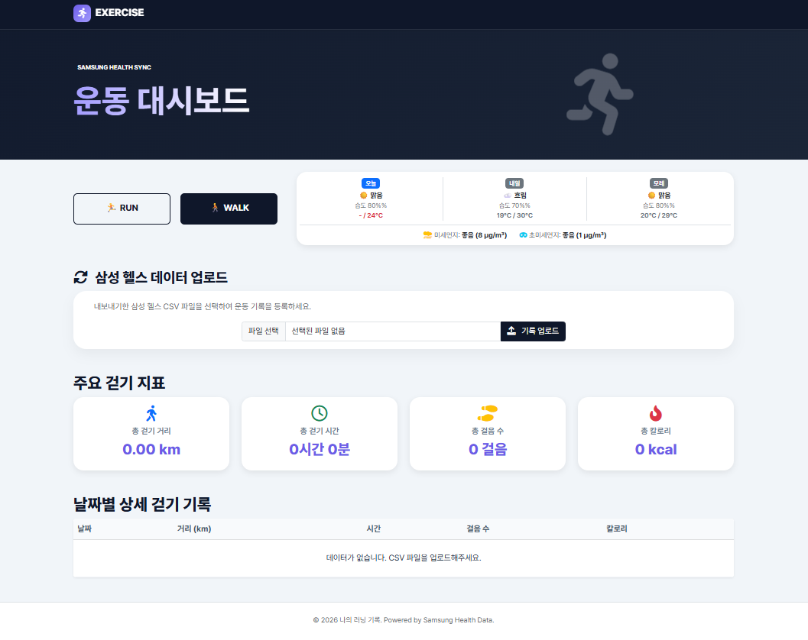
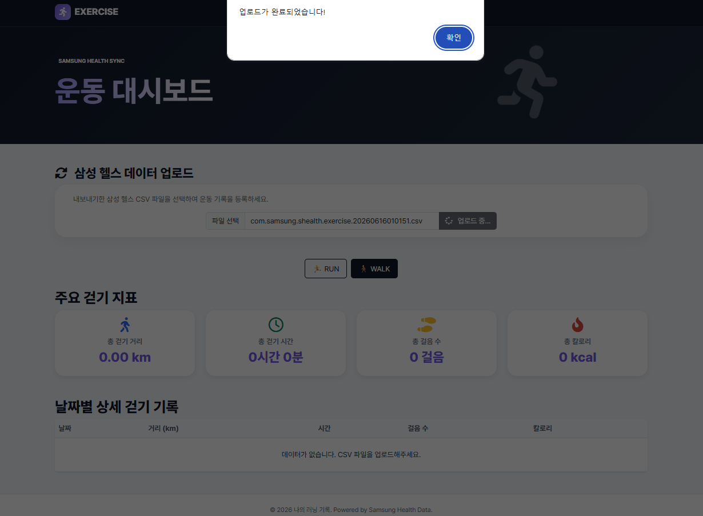
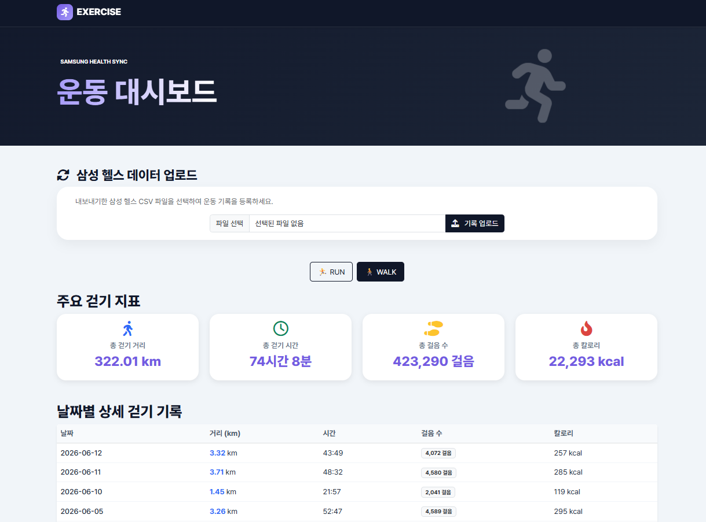
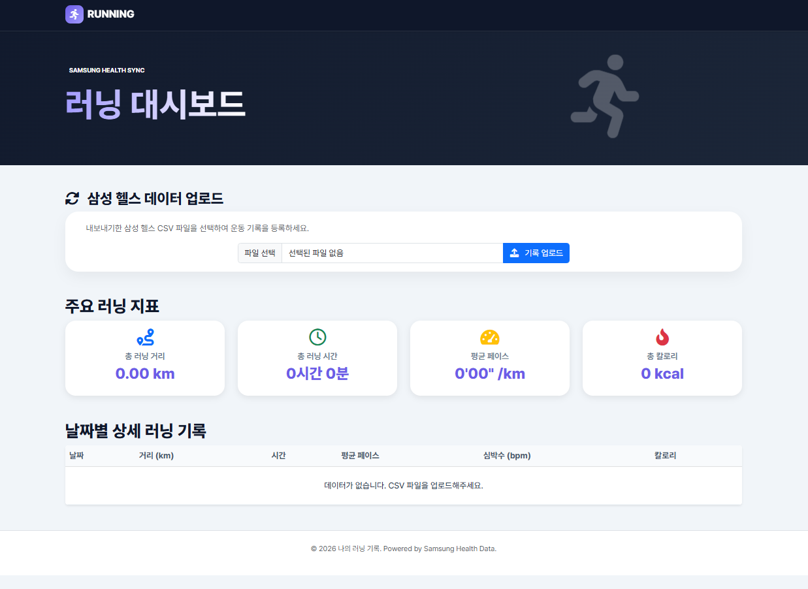
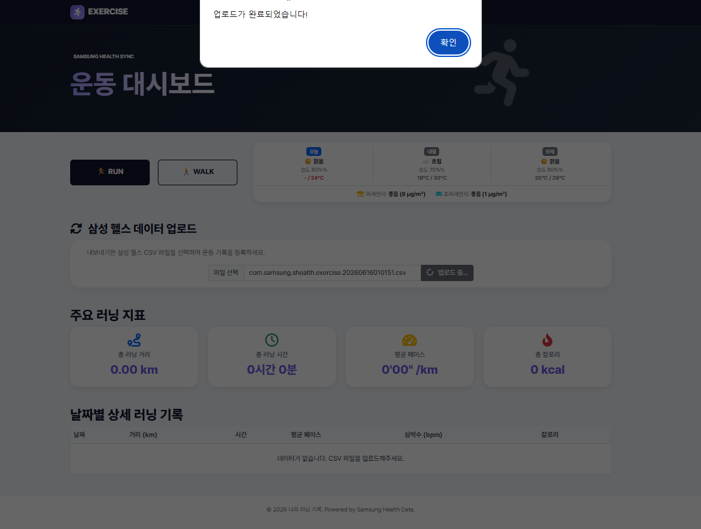
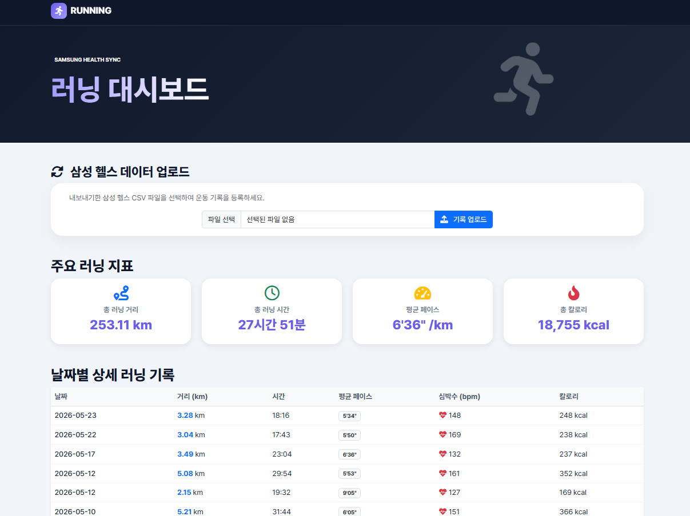

  
  <h3>삼성 헬스의 CSV파일을 이용한 개인 러닝 기록</h3>

## ⌨️ 기간

- **2026.05.21 ~ 2026.05.28(7일)** → 프로젝트 초안 완성
- **2026.06.15 ~ 2026.06.20(6일)** → 걷기 기능 추가, 기상청 및 에어코리아 공공 API 요청하여 날씨 및 미세먼지 정보 화면에 표시

 

## 🔎 목차

1. <a href="#subject">🎯 주제</a>
1. <a href="#mainContents">⭐️ 주요 기능</a>
1. <a href="#systemArchitecture">⚙ 시스템 아키텍쳐</a>
1. <a href="#skills">🛠️ 기술 스택</a>
1. <a href="#erd">💾 ERD</a>
1. <a href="#contents">🖥️ 화면 소개</a>
1. <a href="#developers">👥 팀원 소개</a>

 

<!------- 주제 시작 -------->

## 🎯 주제

**Ajax** **REST API** 이용한 삼성 헬스 데이터를 추출하여 개인 걷기, 달리기 기록 
 
삼성 헬스의 CSV 파일의 달리기 기록 데이터를 가공하여 필요한 걷기, 달리기 기록을 
화면에 표시하여 내가 운동한 기록을 확인할 수 있는 프로젝트입니다.

 

**주요 기능**

- 삼성 헬스에서 받은 데이터 파일(CSV)을 가공하여 내가 여태 운동한 기록을 보여줍니다.
  

<a href="#tableContents">목차로 이동</a>

 

<!------- 주요 기능 시작 -------->

## ⭐️ 주요 기능

### 공통

- CSV 파일을 업로드하여 등록하면 업로드한 CSV 파일 데이터를 분석합니다.
- 기상청과 에어코리아의 공공 데이터를 받아와서 날씨 및 미세먼지 데이터를 화면에 출력합니다.

---

### 걷기

- 걷기 데이터(코드 : 1001)를 추출합니다.
- 달리기의 경우 시작 시간, 거리(m), 칼로리(kcal), 심박수(bpm), 평균 속도(m/s) 데이터를 추출합니다.
- 평균 페이스를 거리와 평균 속도로 분당 페이스와 운동 시간을 계산합니다.
- 출발 시간에 있는 날짜 데이터만 추출하여 날짜를 표시합니다.

---

### 달리기

- 달리기 데이터(코드 : 1002)를 추출합니다.
- 달리기의 경우 시작 시간, 종료시간, 거리(m), 칼로리(kcal), 걸음수 데이터를 추출합니다.
- 시작 시간과 종료 시간 사이값으로 운동 시간을 계산합니다.
- 같은 날짜 운동 데이터는 합산하여 하나의 데이터로 합산하여 화면에 표현합니다.
- 출발 시간에 있는 날짜 데이터만 추출하여 날짜를 표시합니다.

---

<a href="#tableContents">목차로 이동</a>

 

<!------- 시스템 아키텍쳐 시작 -------->

## ⚙ 시스템 아키텍쳐

- Frontend: HTML5, CSS3, JavaScript를 활용하여 깔끔하고 가독성 좋은 UI와 Ajax를 이용한 비동기 통신 환경을 구축
- Backend & DB: Spring Boot를 사용하여 서버를 구현하였으며, MySQL을 통해 데이터를 관리

본 프로젝트는 Spring Boot 아키텍처를 기반으로 설계된 개인 러닝 데이터 기록입니다. 
Ajax를 활용한 비동기 통신 구조로 화면 전환 없이 CSV파일을 등록 시 데이터를 가공하여 화면에 표시해줍니다.

<a href="#tableContents">목차로 이동</a>

 

<!------- 기술 스택 시작 -------->

## 🛠️ 기술 스택

### 💻 FrontEnd

---

### ⚙️ BackEnd

---

### 🤝 Collaboration

---

<a href="#tableContents">목차로 이동</a>

 

<!------- ERD 시작 -------->

## 💾 ERD

<a href="#tableContents">목차로 이동</a>

 

<!------- 화면 소개 시작 -------->

 

## 🖥️ 화면 소개

### 걷기

<table>
    <tr>
        <td align="center" width="200">
            <h5>메인 페이지</h5>
              
        </td>
        <td align="center" width="200">
            <h5>CSV 업로드 처리</h5>
              
        </td> 
        <td align="center" width="200">
            <h5>데이터 추출 후 표시</h5>
            
        </td>
    </tr>
    <tr>
      <td align="center">
        
✔ 메인 화면

      </td>
      <td align="center">
        
✔ CSV 업로드 시 데이터 처리

        
✔ alert 창 button 변경

      </td>
      <td align="center">
        
✔ 가공된 데이터 화면에 표시

      </td>
    </tr>
</table>

### 달리기

<table>
    <tr>
        <td align="center" width="200">
            <h5>메인 페이지</h5>
              
        </td>
        <td align="center" width="200">
            <h5>CSV 업로드 처리</h5>
              
        </td> 
        <td align="center" width="200">
            <h5>데이터 추출 후 표시</h5>
            
        </td>
    </tr>
    <tr>
      <td align="center">
        
✔ 메인 화면

      </td>
      <td align="center">
        
✔ CSV 업로드 시 데이터 처리

        
✔ alert 창 button 변경

      </td>
      <td align="center">
        
✔ 가공된 데이터 화면에 표시

      </td>
    </tr>
</table>

<a href="#tableContents">목차로 이동</a>

 

---

<!------- 팀원 소개 시작 -------->

## 👥 팀원 소개

<table>
    <tr>
        <td align="center" width="200">
            <h5>Name</h5>
        </td>
        <td align="center" width="200">
            <h5>백세원</h5>
        </td>
    </tr>
    <tr>
        <td align="center" width="200">
            <h5>역할</h5>
        </td>
        <td align="center" width="200">
            <h5>풀스택</h5>
        </td>
    </tr>
</table>

## ✔ 향후 계획

- user 테이블을 추가하여 현재 이용하고 있는 사용자의 성별 및 나이대를 받을 예정
- 성별, 나이대별 다른 사람의 데이터를 받아와서 이용하는 사용자의 수준을 표시해주는 기능을 추가 예정
- 해당 날짜 러닝 기록 클릭 시 Modal창을 이용하여 위치 기반 서비스 기반 러닝 경로 표시

<a href="#tableContents">목차로 이동</a>

